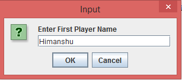
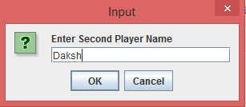
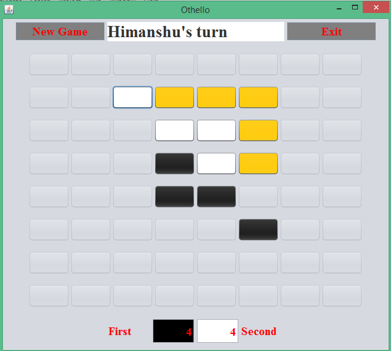
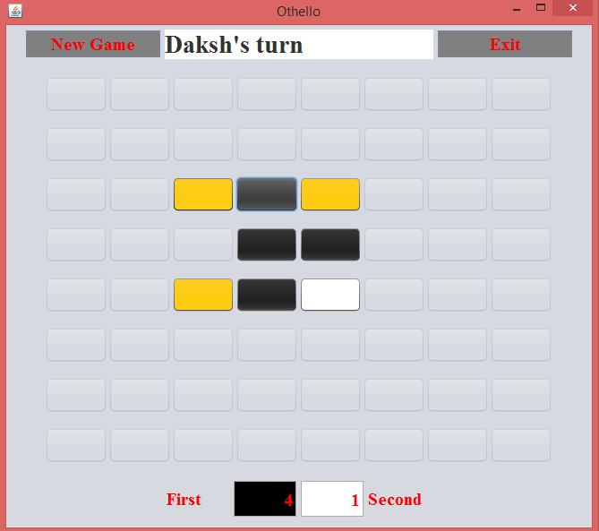
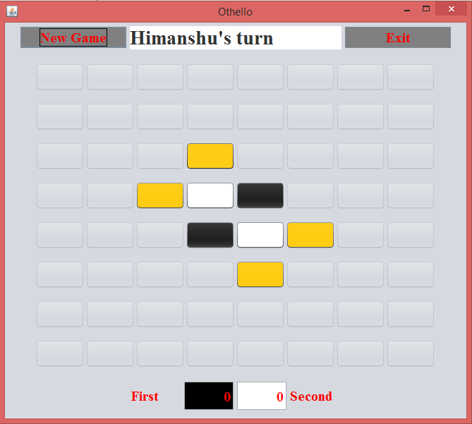

# Othello
:white_circle::black_circle:Reversi is a strategy board game for two players, played on an 8×8 uncheckered board.Players take turns placing disks on the board with their assigned color . During a play, any disks of the opponent's color that are in a straight line and bounded by the disk  of the current player's color are turned over to the current player's color.
# Screenshots

  &nbsp;
  &nbsp;

  &nbsp;
  &nbsp;
  

